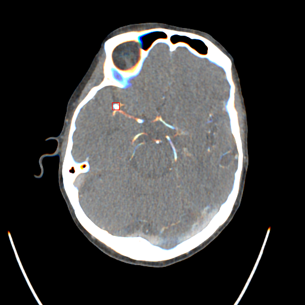
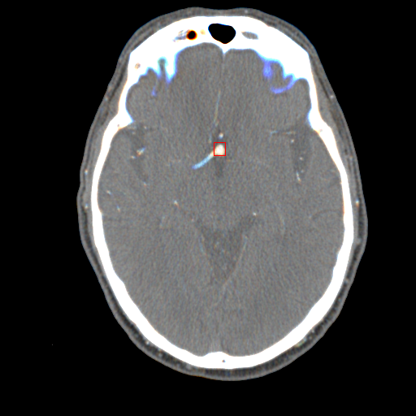
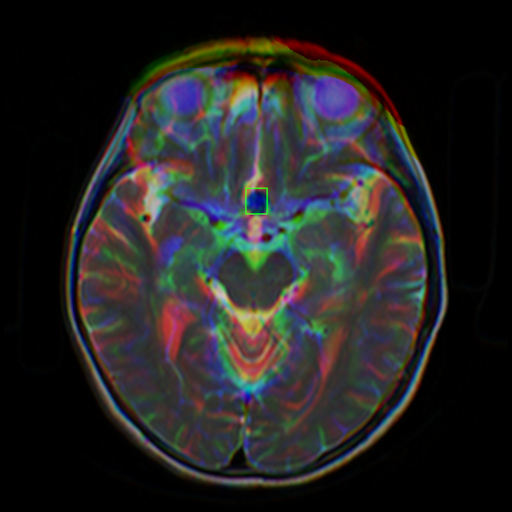
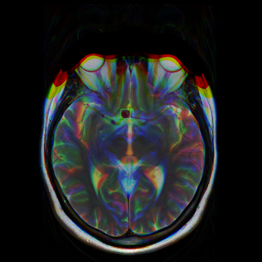
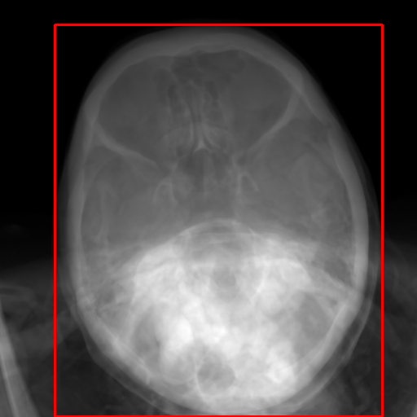
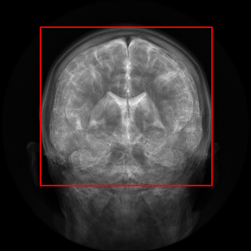
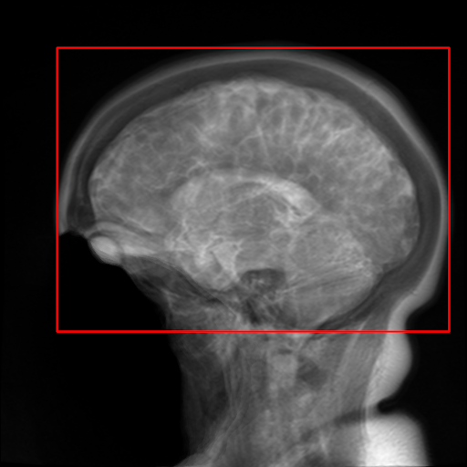

# RSNA-Intracranial-Aneurysm-Detection

xxx place for [RSNA-Intracranial-Aneurysm-Detection Challenge](https://www.kaggle.com/competitions/rsna-intracranial-aneurysm-detection/leaderboard)

[Solution Summary]()

[Model weights]()

### 1. Environment
- Ubuntu 22.04 LTS
- CUDA 12.1
- Nvidia Driver Version: 560.35.03
- Python 3.11.13

```shell
conda create -n venv python=3.11.13
conda activate venv
conda install pytorch==2.5.1 torchvision==0.20.1 pytorch-cuda=12.1 -c pytorch -c nvidia
pip install -r requirements.txt
```

### 2. Data preparation
#### 2.1. Download data
- Download [competition dataset](https://www.kaggle.com/competitions/rsna-intracranial-aneurysm-detection/data) and extract to folder [./dataset](./dataset)
- Download external dataset [Lausanne_TOFMRA](https://openneuro.org/datasets/ds003949/versions/1.0.1) and [Royal_Brisbane_TOFMRA](https://openneuro.org/datasets/ds005096/versions/1.0.3) to folder [./dataset/external](./dataset/external)
```shell
cd dataset/external
sudo snap install aws-cli --classic
aws s3 sync --no-sign-request s3://openneuro.org/ds003949 Lausanne_TOFMRA
aws s3 sync --no-sign-request s3://openneuro.org/ds005096 Royal_Brisbane_TOFMRA
```
- dataset structure should be as follows:
```
dataset
├── series
│   ├── SeriesInstanceUID*
│   |   └── *.dcm
├── train.csv
├── train_localizers.csv
├── train_kfold.csv                 ### my kfold
├── kaggle_evaluation
└── external
    ├── Lausanne_TOFMRA
    │   ├── derivatives
    |   ├── sub-xxx
    └── Royal_Brisbane_TOFMRA
        ├── derivatives
        ├── sub-xxx
```
#### 2.2. Prepare image and label
Each image I used in this solution has 3 channels corresponding to slice (t-1), slice (t), and slice (t+1).
Run following scripts
```shell
cd src/prepare
python dicom2image_slice_level.py
python dicom2image_lausanne.py
python dicom2image_royal_brisbane.py
python prepare_label_slice_level.py
```

### 3. Train models
To reproduce my solution, run the experiments sequentially in the order from exp0 to exp5.
#### 3.1. Exp0 - Aneurysm detection yolov11
In my experience, using only the classification labels (train.csv) is not as effective as combining the classification and localization labels (train_localizers.csv). Therefore, based on the labels provided in train_localizers.csv by the host, for each aneurysm centroid, I searched within ±10 neighboring slices and manually assigned bounding boxes for the aneurysm using [LabelImg](https://github.com/HumanSignal/labelImg). This process does not require specialized medical knowledge since the aneurysm centroids are already provided.

aneurysm | aneurysm | aneurysm_mri_t2 | aneurysm_mri_t2
:----:|:-----:|:--------:|:-------:
 |  |  |  |

```shell
cd src/exp0_aneurysm_det
python prepare_label.py
python train.py --fold 0 && python train.py --fold 1 && python train.py --fold 2 && python train.py --fold 3 && python train.py --fold 4
```
metric   | Fold 0 | Fold 1 | Fold 2 | Fold 3 | Fold 4
:-------:|:------:|:------:|:------:|:------:|:------:
mAP50    | 0.705  | 0.647  | 0.766  | 0.702  | 0.691
mAP50-95 | 0.460  | 0.429  | 0.504  | 0.482  | 0.449

5 models will be used to generate pseudo labeling for external data in experiment 3 and experiment 4

#### 3.2. Exp1 - Brain detection yolov5-v7.0
For each SeriesInstanceUID in the training set, I generate a single image by averaging all slices. Then, I manually annotate the brain bounding box as the following 2 classes: brain (brain in axial view) and abnormal (brain in other views). Each slice in the series will be cropped according to the bounding box predicted by this model. This reduces background noise (especially for slices containing lung regions ...), which improves the model’s accuracy by about **0.03-0.05**.

brain | brain | abnormal | abnormal
:----:|:-----:|:--------:|:-------:
 |  |  |  |

Then run following scripts
```shell
cd src/exp1_brain_det_yolov5_7.0
python prepare_label.py
python train.py --cfg models/yolov5n.yaml --weights yolov5n.pt --data data/brain_det.yaml --batch-size 512 --img-size 640 --device 0 --epochs 150 --name yolov5n_640 --project checkpoints
python python predict_external_dataset.py                  ### predict on external dataset (Lausanne_TOFMRA + Royal_Brisbane_TOFMRA) to create pseudo-labeling
```
Class | P | R | mAP50 | mAP50-95
:----:|:-:|:-:|:-----:|:--------:
all | 0.997 | 1 | 0.995 | 0.948
brain | 0.999 | 1 | 0.995 | 0.991
abnormal | 0.995 | 1 | 0.995 | 0.906

#### 3.3. Exp2 - Classification model
2 classification models (vit large 384 and eva large 384) trained on the RSNA dataset

Run following scripts or use the [./src/exp2_cls/train.ipynb](./src/exp2_cls/train.ipynb)
```shell
cd src/exp2_cls
python train_5folds.py --cfg configs/vit_large_384.yaml              ### for label cleaning in exp4 and exp5
python eval_5folds.py --cfg configs/vit_large_384.yaml               ### for label cleaning in exp4 and exp5
python train_5folds.py --cfg configs/eva_large_384.yaml              ### for label cleaning in exp4 and exp5
python eval_5folds.py --cfg configs/eva_large_384.yaml               ### for label cleaning in exp4 and exp5
python train.py --cfg configs/vit_large_384.yaml                     ### for final_submission
python train.py --cfg configs/eva_large_384.yaml                     ### for final_submission
python predict_external_dataset.py --cfg configs/vit_large_384.yaml  ### predict on external dataset (Lausanne_TOFMRA + Royal_Brisbane_TOFMRA) to create pseudo-labeling
```
Evaluation result (Weighted AUC)
Model         | OOF   | OOF + crop 0.75
:------------:|:-----:|:---------------:
vit large 384 | 0.8491 | 0.8503
eva large 384 | 0.8486 | 0.8551

#### 3.4. Exp3 - Multi-task classification + segmentation
1 model (mit b4 fpn), image size 384 trained on the RSNA dataset. For the submission, I only used the prediction from the classification task.

Run following scripts or use the notebook [./src/exp3_aux/train.ipynb](./src/exp3_aux/train.ipynb)
```shell
cd src/exp3_aux
python train.py --cfg configs/mit_b4_fpn_384.yaml
python eval.py --cfg configs/mit_b4_fpn_384.yaml
python predict_external_dataset.py --cfg configs/mit_b4_fpn_384.yaml  ### predict on external dataset (Lausanne_TOFMRA + Royal_Brisbane_TOFMRA) to create pseudo-labeling
```
Model          | OOF | OOF + crop 0.75
:-------------:|:------------------:|:------------------------------:
mit-b4 FPN 384 | 0.8469 | 0.8549

#### 3.5. Clean trainset and create pseudo labeling for external dataset
- For negative series in the trainset with 'Aneurysm Present' prediction score  > 0.9, I will change it to positive label and use model exp0 to create localizer label
- For positive series in the external dataset, I only use the series with 'Aneurysm Present' prediction score > 0.5 and use model exp0 to create localization label
```shell
cd src/prepare
python clean_rsna_neg.py
python create_pseudo_labeling_for_external_dataset.py
```
#### 3.6. Exp4 - Classification model
2 classification models trained on the cleaned RSNA dataset + external dataset (Lausanne_TOFMRA + Royal_Brisbane_TOFMRA) pseudo labeling

Run following scripts or use the notebook [./src/exp4_cls_pseudo/train.ipynb](./src/exp4_cls_pseudo/train.ipynb)
```shell
cd exp4_cls_pseudo
python train_5folds.py --cfg configs/vit_large_384.yaml              ### for evaluation
python eval_5folds.py --cfg configs/vit_large_384.yaml               ### for evaluation
python train_5folds.py --cfg configs/eva_large_384.yaml              ### for evaluation
python eval_5folds.py --cfg configs/eva_large_384.yaml               ### for evaluation
python train.py --cfg configs/vit_large_384.yaml                     ### for final_submission
python train.py --cfg configs/eva_large_384.yaml                     ### for final_submission
```
Evaluation result (Weighted AUC)
Model         | OOF   | OOF + crop 0.75
:------------:|:-----:|:---------------:
vit large 384 | 0.8530 | 0.8558
eva large 384 | 0.8505 | 0.8579

#### 3.7. Exp5 - Multi-task classification + segmentation
1 model (mit b4 fpn), image size 384 trained on the cleaned RSNA dataset + external dataset (Lausanne_TOFMRA + Royal_Brisbane_TOFMRA) pseudo labeling. For the submission, I only used the prediction from the classification task.

Run following scripts or use the notebook [./src/exp5_aux_pseudo/train.ipynb](./src/exp5_aux_pseudo/train.ipynb)
```shell
cd src/exp5_aux_pseudo
python train.py --cfg configs/mit_b4_fpn_384.yaml
python eval.py --cfg configs/mit_b4_fpn_384.yaml
```
Model          | OOF | OOF + crop 0.75
:-------------:|:------------------:|:------------------------------:
mit-b4 FPN 384 | 0.8497 | 0.8629

### 4. Final submission
The final submission is the ensemble of 6 models:
- [Final1](https://www.kaggle.com/code/longb173/rsna-iad-final-nb?scriptVersionId=266774552): 0.25 exp3_mit_b4 + 0.25 exp5_mit_b4 + 0.125 exp2_vit_large + 0.125 exp4_vit_large + 0.125 exp2_eva_large + 0.125 exp2_eva_large
- [Final2](https://www.kaggle.com/code/longb173/rsna-iad-final-nb?scriptVersionId=266774672): 0.5 exp3_mit_b4 + 0.125 exp2_vit_large + 0.125 exp4_vit_large + 0.125 exp2_eva_large + 0.125 exp2_eva_large

Notebook | Local CV  | Public LB | Private LB | Rank
:-------:|:---------:|:---------:|:----------:|:----|
[Final1](https://www.kaggle.com/code/longb173/rsna-iad-final-nb?scriptVersionId=266774552)   | 0.8823 | 0.89 |
[Final2](https://www.kaggle.com/code/longb173/rsna-iad-final-nb?scriptVersionId=266774672)   | 0.8767 | 0.89 |

### 5. Demo-Test
Since my submission is an ensemble of multiple models (for increased accuracy), it's quite difficult for users to use. The purpose of this notebook is to package the models into a library so that users can use my solution to test or deploy into their products.

[Demo Notebook](./src/demo-test/test.ipynb)